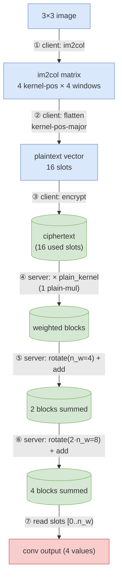

# Conv2d via im2col-encoding — visual walkthrough

Running example: **3×3 image** convolved with a **2×2 kernel**, stride 1, no padding.

## Setup

```
Input image (H×W = 3×3):       Kernel (k=2):
┌───┬───┬───┐                  ┌────┬────┐
│ a │ b │ c │                  │ K₀ │ K₁ │
├───┼───┼───┤                  ├────┼────┤
│ d │ e │ f │                  │ K₂ │ K₃ │
├───┼───┼───┤                  └────┴────┘
│ g │ h │ i │
└───┴───┴───┘

4 sliding windows  (n_w = 4):
W₀ = a b      W₁ = b c      W₂ = d e      W₃ = e f
     d e           e f           g h           h i

Goal:  y_w = K₀·W_w[TL] + K₁·W_w[TR] + K₂·W_w[BL] + K₃·W_w[BR]
```

---

## End-to-end flow



Blue = client (plaintext). Green = server (homomorphic). Pink = decrypted output.

---

## ① Client: im2col

Read each window row-major; stack the values by `(kernel_position, window)`:

```
                window_0   window_1   window_2   window_3
                ════════   ════════   ════════   ════════
kp 0  (TL)       a          b          d          e
kp 1  (TR)       b          c          e          f
kp 2  (BL)       d          e          g          h
kp 3  (BR)       e          f          h          i
```

## ② Client: flatten kernel-pos-major (each kp becomes a contiguous block)

```
 slot:   0   1   2   3 │  4   5   6   7 │  8   9  10  11 │ 12  13  14  15
         ╔═══════════╗   ╔═══════════╗   ╔═══════════╗   ╔═══════════╗
content: ║ a   b   d   e║║ b   c   e   f║║ d   e   g   h║║ e   f   h   i║
         ╚═══════════╝   ╚═══════════╝   ╚═══════════╝   ╚═══════════╝
         └── block 0 ─┘  └── block 1 ─┘  └── block 2 ─┘  └── block 3 ─┘
            (kp 0)           (kp 1)         (kp 2)          (kp 3)
```

Each block has `n_w = 4` slots. There are `k² = 4` blocks. Total used slots = 16.

## ③ Client: encrypt → one ciphertext (drawn with thick green borders below).

---

## ④ Server: multiply by `plain_kernel`

Each kernel weight is broadcast across its block:

```
              slot:   0   1   2   3 │  4   5   6   7 │  8   9  10  11 │ 12  13  14  15

ciphertext (enc):  ┃ a   b   d   e ┃ b   c   e   f ┃ d   e   g   h ┃ e   f   h   i ┃
                       ×  (one plain mul, depth +1)
plain_kernel:      │ K₀  K₀  K₀  K₀│ K₁  K₁  K₁  K₁│ K₂  K₂  K₂  K₂│ K₃  K₃  K₃  K₃│
                   ───────────────────────────────────────────────────────────────
after ×:           ┃K₀a K₀b K₀d K₀e│K₁b K₁c K₁e K₁f│K₂d K₂e K₂g K₂h│K₃e K₃f K₃h K₃i┃
                   ─── block B₀ ───  ─── block B₁ ──  ─── block B₂ ──  ─── block B₃ ──
```

After this, each window `w`'s four contributions `Kₚ · W_w[p]` are scattered across the four blocks at column `w`.

---

## ⑤ Server: rotate by `n_w = 4`, add to original

Rotation shifts contents *toward slot 0* by 4 — block `Bₚ₊₁` moves into where `Bₚ` was.

```
state before rot:    [ B₀ │ B₁ │ B₂ │ B₃ ]   slots 0..15

rotate(4):           [ B₁ │ B₂ │ B₃ │ ·· ]   block 0 now holds B₁, etc.
                       ▲                       slots 12..15 hold wrap garbage (we ignore)
                       │ ← B₁ moved here from slots 4..7

add (state += rot):  [B₀+B₁ │ B₁+B₂ │ B₂+B₃ │  · ]
                       ───────────────────
                       window w is at col w; each window now has 2 of 4 sums:
                       slot w     = K₀·W_w[TL] + K₁·W_w[TR]
                       slot w+4   = K₁·W_w[TR] + K₂·W_w[BL]   (partial overlap, ignored)
                       slot w+8   = K₂·W_w[BL] + K₃·W_w[BR]
                       slot w+12  = garbage
```

So after step ⑤, the *missing 2 contributions* for each window live in slots `[8..12)`.

---

## ⑥ Server: rotate by `2·n_w = 8`, add

```
state before rot:    [B₀+B₁ │ B₁+B₂ │ B₂+B₃ │  · ]

rotate(8):           [B₂+B₃ │   ·   │   ·    │  · ]
                       ▲
                       │ ← (B₂+B₃) moved here from slots 8..11

add:                 [B₀+B₁+B₂+B₃ │  ··· │  ··· │ ··· ]
                       ▲▲▲▲▲▲▲▲▲▲▲▲▲
                       slot 0 = K₀a + K₁b + K₂d + K₃e   ← window 0 ✓
                       slot 1 = K₀b + K₁c + K₂e + K₃f   ← window 1 ✓
                       slot 2 = K₀d + K₁e + K₂g + K₃h   ← window 2 ✓
                       slot 3 = K₀e + K₁f + K₂h + K₃i   ← window 3 ✓
```

`log₂(k²) = 2` rotations total. All using powers-of-2 Galois keys we already have.

---

## ⑦ Read the result

The convolved output lives in slots `[0, n_w)`. Slots `[n_w, slot_count)` are byproducts of the algorithm and are ignored by the next layer.

```
                ┌──────────────────────────────────────┐
final ct slot:  │ 0 → y_0   1 → y_1   2 → y_2   3 → y_3 │  4..15 → garbage
                └──────────────────────────────────────┘
                              ↑
                        the convolution!
```

---

## At-a-glance summary

```
PHASE                            SLOTS [0..16)
═══════════════════════════════  ══════════════════════════════════════════════════
① im2col + flatten (client)      [ a b d e │ b c e f │ d e g h │ e f h i ]
③ encrypted                       (above, but encrypted)
④ × plain_kernel                 [ K₀·B₀  │ K₁·B₁  │ K₂·B₂  │ K₃·B₃ ]
⑤ + rotate(4)                    [ B₀+B₁  │ B₁+B₂  │ B₂+B₃  │   ·    ]
⑥ + rotate(8)                    [ Σ all 4│   ·    │   ·    │   ·    ]
                                   ▲▲▲▲▲
                                   y_0 y_1 y_2 y_3
```

- **Client work:** plaintext im2col + flatten + encrypt. Free relative to FHE costs.
- **Server work:** **1 plain-mul + 2 rotations + 2 adds** for the whole convolution.

---

## Generalisation

For input `H × W`, kernel `k × k`, stride 1, no padding:

| Quantity            | Value                              |
|---------------------|------------------------------------|
| `n_w` (windows)     | `(H − k + 1) · (W − k + 1)`        |
| Blocks              | `k²`                               |
| Used slots          | `k² · n_w` (must fit `slot_count`) |
| Server plain-muls   | `1` per input-channel × output-ch  |
| Server rotations    | `log₂(k²)` per output channel      |
| Multiplicative depth| `1`                                |

For multi-channel input/output, repeat the single-channel pipeline per `(in_channel, out_channel)` pair, adding results homomorphically. The slot layout and rotation amounts are unchanged.
